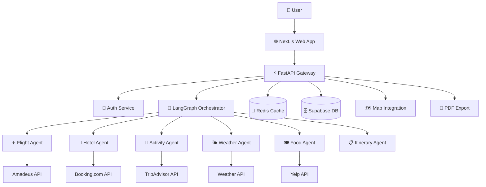
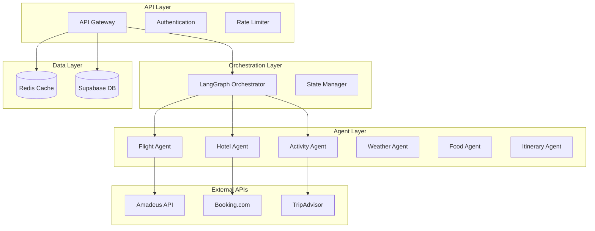
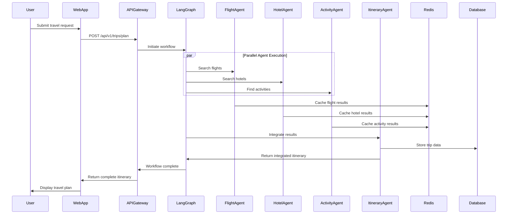

# Travel Companion Architecture Document

## Introduction

This document outlines the overall project architecture for **Travel Companion**, including backend systems, shared services, and non-UI specific concerns. Its primary goal is to serve as the guiding architectural blueprint for AI-driven development, ensuring consistency and adherence to chosen patterns and technologies.

**Relationship to Frontend Architecture:**
The project includes a significant user interface (responsive web app with map integration), so a separate Frontend Architecture Document will detail the frontend-specific design and MUST be used in conjunction with this document. Core technology stack choices documented herein (see "Tech Stack") are definitive for the entire project, including frontend components.

### Starter Template or Existing Project

**Decision:** Using established community templates for rapid development:
- **Backend:** FastAPI with async patterns and dependency injection boilerplate
- **Frontend:** Next.js 14 with TypeScript and Tailwind CSS starter
- **Database:** Supabase starter templates with authentication scaffolding
- **Containerization:** Docker multi-stage builds optimized for Python/Node.js

**Rationale:** Leveraging proven templates accelerates development while maintaining best practices for the multi-agent LangGraph architecture.

### Change Log

| Date | Version | Description | Author |
|------|---------|-------------|---------|
| 2025-01-22 | v1.0 | Initial architecture creation | Winston (Architect) |

## High Level Architecture

### Technical Summary

The Travel Companion system employs a **microservices-oriented monolith** architecture with FastAPI orchestrating multi-agent workflows through LangGraph. The system uses event-driven patterns for agent coordination, maintains stateful conversations through Redis, and provides real-time travel planning through parallel API integrations. The architecture prioritizes horizontal scalability, fault tolerance, and efficient caching to handle travel industry API rate limits while delivering sub-30-second response times.

### High Level Overview

**Architectural Style:** Microservices-oriented monolith with agent-based service decomposition
**Repository Structure:** Monorepo with clear service boundaries (`packages/api`, `packages/web`, `packages/agents`)
**Service Architecture:** Containerized FastAPI backend with specialized travel planning agents
**Primary User Flow:** Natural language request → LangGraph workflow orchestration → parallel agent execution → unified itinerary response
**Key Decisions:**
- LangGraph for workflow orchestration enables complex multi-step reasoning
- Redis for caching and rate limit management across external travel APIs
- Supabase for user data with vector embeddings for travel preference RAG
- Event-driven architecture for agent coordination and real-time updates

### High Level Project Diagram



### Architectural and Design Patterns

- **Event-Driven Architecture:** Using Redis pub/sub for agent coordination and real-time updates - *Rationale:* Enables async agent execution and progress updates to frontend
- **Repository Pattern:** Abstract data access for users, trips, and preferences - *Rationale:* Enables testing and future database migration flexibility  
- **Agent Pattern:** Specialized agents with single responsibilities (flights, hotels, etc.) - *Rationale:* Aligns with travel domain complexity and external API boundaries
- **Circuit Breaker Pattern:** For external API resilience - *Rationale:* Travel APIs are notoriously unreliable, need graceful degradation
- **CQRS Pattern:** Read/write separation for trip planning vs trip viewing - *Rationale:* Different performance characteristics for planning workflows vs viewing itineraries
- **Saga Pattern:** For coordinated multi-step booking processes - *Rationale:* Travel bookings require complex transaction coordination across services

## Tech Stack

### Cloud Infrastructure
- **Provider:** Initially local/Docker, designed for AWS deployment
- **Key Services:** ECS/Fargate for containerized services, ElastiCache for Redis, RDS for Supabase
- **Deployment Regions:** US-East-1 primary, EU-West-1 for international users

### Technology Stack Table

| Category | Technology | Version | Purpose | Rationale |
|----------|------------|---------|---------|-----------|
| **Language** | Python | 3.11+ | Backend development | Async support, LangGraph compatibility, rich AI/ML ecosystem |
| **Backend Framework** | FastAPI | 0.104+ | API orchestration | High performance, excellent OpenAPI docs, async native |
| **Workflow Engine** | LangGraph | 0.0.40+ | Multi-agent orchestration | Purpose-built for AI agent workflows, state management |
| **Frontend Framework** | Next.js | 14.1+ | Web application | React-based, excellent TypeScript support, SSR capabilities |
| **Language** | TypeScript | 5.3+ | Frontend development | Type safety, excellent tooling, team consistency |
| **Database** | Supabase | Latest | User data & vector embeddings | PostgreSQL with built-in auth, real-time, vector support |
| **Caching** | Redis | 7.2+ | API caching & rate limiting | High performance, pub/sub for real-time updates |
| **Container Platform** | Docker | 24.0+ | Development & deployment | Consistent environments, easy scaling |
| **Process Manager** | UV | 0.1.15+ | Python dependency management | Blazing fast, Rust-based, modern Python tooling |
| **Styling** | Tailwind CSS | 3.4+ | Frontend styling | Utility-first, rapid development, consistent design |
| **Map Integration** | Mapbox | GL JS v2 | Interactive maps | Excellent customization, performance, travel-focused features |
| **HTTP Client** | httpx | 0.25+ | Async API calls | Modern async HTTP client for Python |
| **Validation** | Pydantic | 2.5+ | Data models & validation | Runtime type checking, excellent FastAPI integration |
| **Testing Framework** | pytest | 7.4+ | Backend testing | Industry standard, excellent fixture support |
| **Testing Framework** | Vitest | 1.2+ | Frontend testing | Fast, Vite-based, excellent TypeScript support |

## Data Models

### User
**Purpose:** Represents authenticated users with travel preferences and history

**Key Attributes:**
- user_id: UUID - Primary identifier
- email: string - Authentication credential  
- travel_preferences: JSON - Stored preferences (budget ranges, accommodation types, activity interests)
- trip_history: Relationship - Past trips for personalization

**Relationships:**
- One-to-many with Trip entities
- One-to-many with SavedPreferences

### Trip
**Purpose:** Represents a complete travel planning session with all components

**Key Attributes:**
- trip_id: UUID - Primary identifier
- user_id: UUID - Foreign key to User
- destination: string - Primary travel destination
- start_date: date - Trip start date
- end_date: date - Trip end date
- budget: decimal - Total trip budget
- status: enum - (planning, booked, completed, cancelled)
- itinerary_data: JSON - Complete itinerary with all bookings

**Relationships:**
- Belongs to User
- Has many FlightOptions, HotelOptions, ActivityOptions

### FlightOption
**Purpose:** Stores flight search results and user selections

**Key Attributes:**
- flight_id: UUID - Primary identifier
- trip_id: UUID - Foreign key to Trip
- airline: string - Airline name
- price: decimal - Flight price
- departure_time: datetime - Departure timestamp
- arrival_time: datetime - Arrival timestamp
- duration: integer - Flight duration in minutes
- stops: integer - Number of stops

**Relationships:**
- Belongs to Trip
- Related to external booking systems

### HotelOption
**Purpose:** Accommodation options with booking details

**Key Attributes:**
- hotel_id: UUID - Primary identifier
- trip_id: UUID - Foreign key to Trip
- name: string - Hotel name
- price_per_night: decimal - Nightly rate
- location: Point - Geographic coordinates
- rating: float - Hotel rating (1-5)
- amenities: JSON - Available amenities

**Relationships:**
- Belongs to Trip
- Geographic relationship with activities

## Components

### API Gateway Service
**Responsibility:** Request routing, authentication, rate limiting, and response coordination

**Key Interfaces:**
- REST API endpoints for all travel planning operations
- WebSocket connections for real-time workflow updates
- Health check and monitoring endpoints

**Dependencies:** Authentication service, Redis cache, workflow orchestrator

**Technology Stack:** FastAPI with middleware for CORS, rate limiting, JWT validation

### LangGraph Workflow Orchestrator
**Responsibility:** Coordinates multi-agent travel planning workflows with state management

**Key Interfaces:**
- Workflow execution API accepting travel requests
- Agent registration and coordination system
- State persistence and recovery mechanisms

**Dependencies:** All travel agents, Redis for state, database for trip storage

**Technology Stack:** LangGraph with custom nodes for each travel planning phase

### Flight Planning Agent
**Responsibility:** Flight search, comparison, and booking integration

**Key Interfaces:**
- Flight search API with flexible date/destination parameters
- Price tracking and alert mechanisms
- Integration with multiple airline booking systems

**Dependencies:** External flight APIs (Amadeus, Skyscanner), Redis cache

**Technology Stack:** Python with httpx for API calls, circuit breaker patterns

### Hotel Booking Agent
**Responsibility:** Accommodation search with location and preference optimization

**Key Interfaces:**
- Hotel search with geographic and amenity filtering
- Price comparison across multiple booking platforms
- Availability checking and booking coordination

**Dependencies:** Booking.com, Expedia, Airbnb APIs, geographic services

**Technology Stack:** Python with location-based search algorithms

### Activity Discovery Agent  
**Responsibility:** Activity and attraction recommendations based on interests

**Key Interfaces:**
- Interest-based activity search and categorization
- Time-based scheduling and duration estimation
- Local event and seasonal activity integration

**Dependencies:** TripAdvisor, Viator, GetYourGuide APIs, weather data

**Technology Stack:** Python with ML-based recommendation algorithms

### Weather Intelligence Agent
**Responsibility:** Weather forecasting and activity impact analysis

**Key Interfaces:**
- Multi-day weather forecasting for destinations
- Weather-based activity recommendations
- Travel advisory generation

**Dependencies:** Weather API services, geographic data

**Technology Stack:** Python with weather data processing algorithms

### Restaurant Recommendation Agent
**Responsibility:** Dining recommendations with cuisine and budget matching

**Key Interfaces:**
- Cuisine-based restaurant search and filtering
- Budget-appropriate dining recommendations
- Local specialty and dietary restriction handling

**Dependencies:** Yelp, Google Places, Zomato APIs, user preference data

**Technology Stack:** Python with cuisine categorization and rating analysis

### Itinerary Coordination Agent
**Responsibility:** Integration of all travel components into optimized daily schedules

**Key Interfaces:**
- Geographic optimization for daily itineraries
- Budget allocation and tracking across categories
- Conflict detection and resolution

**Dependencies:** All other agents, mapping services, optimization algorithms

**Technology Stack:** Python with geographic optimization and scheduling algorithms

### Component Diagrams



## External APIs

### Amadeus Travel API
- **Purpose:** Comprehensive flight search and booking data
- **Documentation:** https://developers.amadeus.com/
- **Base URL(s):** https://api.amadeus.com/v2/
- **Authentication:** OAuth 2.0 with client credentials
- **Rate Limits:** 10 requests/second, 1000 requests/month (sandbox)

**Key Endpoints Used:**
- `GET /shopping/flight-offers` - Flight search with flexible parameters
- `GET /shopping/flight-destinations` - Destination discovery
- `POST /booking/flight-orders` - Flight booking creation

**Integration Notes:** Primary flight data source, requires careful rate limit management and caching strategy

### Booking.com API
- **Purpose:** Hotel and accommodation search with detailed property information
- **Documentation:** https://developers.booking.com/api/
- **Base URL(s):** https://distribution-xml.booking.com/
- **Authentication:** XML API with credentials
- **Rate Limits:** 100 requests/minute per property type

**Key Endpoints Used:**
- `POST /json/bookings.getHotelAvailabilityV2` - Hotel availability search
- `POST /json/bookings.getHotelDescriptionPhotosV2` - Hotel details and images

**Integration Notes:** XML-based API requiring custom parsing, extensive property data available

### TripAdvisor Content API
- **Purpose:** Activity, attraction, and restaurant data with reviews
- **Documentation:** https://developer-tripadvisor.com/
- **Base URL(s):** https://api.content.tripadvisor.com/api/v1/
- **Authentication:** API Key authentication
- **Rate Limits:** 500 requests/day (free tier)

**Key Endpoints Used:**  
- `GET /location/search` - Location-based activity search
- `GET /location/{locationId}/details` - Detailed activity information

**Integration Notes:** Rich content data but limited rate limits, requires strategic caching

### OpenWeatherMap API
- **Purpose:** Weather forecasting and historical weather data
- **Documentation:** https://openweathermap.org/api
- **Base URL(s):** https://api.openweathermap.org/data/2.5/
- **Authentication:** API Key authentication
- **Rate Limits:** 60 calls/minute, 1M calls/month (free)

**Key Endpoints Used:**
- `GET /forecast` - 5-day weather forecast
- `GET /onecall` - Comprehensive weather data with alerts

**Integration Notes:** Reliable weather data with good free tier limits, essential for activity planning

### Yelp Fusion API
- **Purpose:** Restaurant and business search with reviews and ratings
- **Documentation:** https://www.yelp.com/developers/documentation/v3
- **Base URL(s):** https://api.yelp.com/v3/
- **Authentication:** Bearer token authentication
- **Rate Limits:** 5000 API calls per day

**Key Endpoints Used:**
- `GET /businesses/search` - Restaurant search by location and cuisine
- `GET /businesses/{id}` - Detailed restaurant information

**Integration Notes:** Excellent restaurant data for US/international locations, good rate limits

## Core Workflows



## REST API Spec

```yaml
openapi: 3.0.0
info:
  title: Travel Companion API
  version: 1.0.0
  description: Multi-agent travel planning API with LangGraph orchestration
servers:
  - url: http://localhost:8000/api/v1
    description: Development server
  - url: https://api.travelcompanion.com/api/v1
    description: Production server

paths:
  /trips/plan:
    post:
      summary: Create new travel plan
      description: Initiates multi-agent workflow to create comprehensive travel itinerary
      requestBody:
        required: true
        content:
          application/json:
            schema:
              type: object
              required: [destination, start_date, end_date, budget]
              properties:
                destination:
                  type: string
                  example: "Tokyo, Japan"
                start_date:
                  type: string
                  format: date
                  example: "2024-06-01"
                end_date:
                  type: string
                  format: date
                  example: "2024-06-07"
                budget:
                  type: number
                  format: decimal
                  example: 3000.00
                travelers:
                  type: integer
                  default: 1
                  example: 2
                preferences:
                  type: object
                  properties:
                    accommodation_type:
                      type: string
                      enum: [hotel, hostel, airbnb, luxury]
                    activity_interests:
                      type: array
                      items:
                        type: string
                      example: ["cultural", "adventure", "food"]
      responses:
        '201':
          description: Trip planning initiated successfully
          content:
            application/json:
              schema:
                type: object
                properties:
                  trip_id:
                    type: string
                    format: uuid
                  status:
                    type: string
                    example: "planning"
                  estimated_completion:
                    type: string
                    format: date-time
        '400':
          description: Invalid request parameters
        '429':
          description: Rate limit exceeded

  /trips/{trip_id}:
    get:
      summary: Get trip details
      parameters:
        - name: trip_id
          in: path
          required: true
          schema:
            type: string
            format: uuid
      responses:
        '200':
          description: Complete trip itinerary
          content:
            application/json:
              schema:
                type: object
                properties:
                  trip_id:
                    type: string
                    format: uuid
                  status:
                    type: string
                    enum: [planning, completed, error]
                  itinerary:
                    type: object
                    properties:
                      flights:
                        type: array
                        items:
                          $ref: '#/components/schemas/FlightOption'
                      hotels:
                        type: array
                        items:
                          $ref: '#/components/schemas/HotelOption'
                      activities:
                        type: array
                        items:
                          $ref: '#/components/schemas/ActivityOption'

components:
  schemas:
    FlightOption:
      type: object
      properties:
        flight_id:
          type: string
          format: uuid
        airline:
          type: string
        price:
          type: number
          format: decimal
        departure_time:
          type: string
          format: date-time
        arrival_time:
          type: string
          format: date-time
        duration:
          type: integer
          description: Duration in minutes
    
    HotelOption:
      type: object
      properties:
        hotel_id:
          type: string
          format: uuid
        name:
          type: string
        price_per_night:
          type: number
          format: decimal
        location:
          type: object
          properties:
            latitude:
              type: number
            longitude:
              type: number
        rating:
          type: number
          format: float
          minimum: 1
          maximum: 5
    
    ActivityOption:
      type: object
      properties:
        activity_id:
          type: string
          format: uuid
        name:
          type: string
        description:
          type: string
        price:
          type: number
          format: decimal
        duration:
          type: integer
          description: Duration in minutes
        category:
          type: string
          enum: [cultural, adventure, food, entertainment, nature]
```

## Database Schema

```sql
-- Users and Authentication
CREATE TABLE users (
    user_id UUID PRIMARY KEY DEFAULT gen_random_uuid(),
    email VARCHAR(255) UNIQUE NOT NULL,
    password_hash VARCHAR(255) NOT NULL,
    first_name VARCHAR(100),
    last_name VARCHAR(100),
    travel_preferences JSONB DEFAULT '{}',
    created_at TIMESTAMP WITH TIME ZONE DEFAULT NOW(),
    updated_at TIMESTAMP WITH TIME ZONE DEFAULT NOW()
);

-- Trip Planning Sessions
CREATE TABLE trips (
    trip_id UUID PRIMARY KEY DEFAULT gen_random_uuid(),
    user_id UUID REFERENCES users(user_id) ON DELETE CASCADE,
    destination VARCHAR(255) NOT NULL,
    start_date DATE NOT NULL,
    end_date DATE NOT NULL,
    total_budget DECIMAL(10,2),
    traveler_count INTEGER DEFAULT 1,
    status trip_status DEFAULT 'planning',
    preferences JSONB DEFAULT '{}',
    itinerary_data JSONB DEFAULT '{}',
    created_at TIMESTAMP WITH TIME ZONE DEFAULT NOW(),
    updated_at TIMESTAMP WITH TIME ZONE DEFAULT NOW()
);

CREATE TYPE trip_status AS ENUM ('planning', 'completed', 'booked', 'cancelled');

-- Flight Options (normalized for comparison)
CREATE TABLE flight_options (
    flight_id UUID PRIMARY KEY DEFAULT gen_random_uuid(),
    trip_id UUID REFERENCES trips(trip_id) ON DELETE CASCADE,
    external_id VARCHAR(255), -- API provider's ID
    airline VARCHAR(100) NOT NULL,
    flight_number VARCHAR(20),
    origin VARCHAR(10) NOT NULL, -- Airport code
    destination VARCHAR(10) NOT NULL,
    departure_time TIMESTAMP WITH TIME ZONE NOT NULL,
    arrival_time TIMESTAMP WITH TIME ZONE NOT NULL,
    duration_minutes INTEGER NOT NULL,
    stops INTEGER DEFAULT 0,
    price DECIMAL(10,2) NOT NULL,
    currency CHAR(3) DEFAULT 'USD',
    booking_url TEXT,
    created_at TIMESTAMP WITH TIME ZONE DEFAULT NOW()
);

-- Hotel Options
CREATE TABLE hotel_options (
    hotel_id UUID PRIMARY KEY DEFAULT gen_random_uuid(),
    trip_id UUID REFERENCES trips(trip_id) ON DELETE CASCADE,
    external_id VARCHAR(255),
    name VARCHAR(255) NOT NULL,
    address TEXT,
    location POINT NOT NULL, -- PostGIS point for geographic queries
    price_per_night DECIMAL(10,2) NOT NULL,
    currency CHAR(3) DEFAULT 'USD',
    rating DECIMAL(2,1) CHECK (rating >= 1 AND rating <= 5),
    amenities JSONB DEFAULT '[]',
    photos JSONB DEFAULT '[]',
    booking_url TEXT,
    created_at TIMESTAMP WITH TIME ZONE DEFAULT NOW()
);

-- Activity Options
CREATE TABLE activity_options (
    activity_id UUID PRIMARY KEY DEFAULT gen_random_uuid(),
    trip_id UUID REFERENCES trips(trip_id) ON DELETE CASCADE,
    external_id VARCHAR(255),
    name VARCHAR(255) NOT NULL,
    description TEXT,
    category activity_category NOT NULL,
    location POINT,
    duration_minutes INTEGER,
    price DECIMAL(10,2),
    currency CHAR(3) DEFAULT 'USD',
    rating DECIMAL(2,1),
    booking_url TEXT,
    created_at TIMESTAMP WITH TIME ZONE DEFAULT NOW()
);

CREATE TYPE activity_category AS ENUM (
    'cultural', 'adventure', 'food', 'entertainment', 
    'nature', 'shopping', 'relaxation', 'nightlife'
);

-- Workflow State Tracking
CREATE TABLE workflow_states (
    state_id UUID PRIMARY KEY DEFAULT gen_random_uuid(),
    trip_id UUID REFERENCES trips(trip_id) ON DELETE CASCADE,
    current_step VARCHAR(100) NOT NULL,
    step_data JSONB DEFAULT '{}',
    completed_steps JSONB DEFAULT '[]',
    error_message TEXT,
    created_at TIMESTAMP WITH TIME ZONE DEFAULT NOW(),
    updated_at TIMESTAMP WITH TIME ZONE DEFAULT NOW()
);

-- Indexes for Performance
CREATE INDEX idx_trips_user_id ON trips(user_id);
CREATE INDEX idx_trips_dates ON trips(start_date, end_date);
CREATE INDEX idx_flight_options_trip ON flight_options(trip_id);
CREATE INDEX idx_hotel_options_trip ON hotel_options(trip_id);
CREATE INDEX idx_hotel_options_location ON hotel_options USING GIST(location);
CREATE INDEX idx_activity_options_trip ON activity_options(trip_id);
CREATE INDEX idx_activity_options_category ON activity_options(category);
CREATE INDEX idx_workflow_states_trip ON workflow_states(trip_id);

-- Enable Row Level Security
ALTER TABLE trips ENABLE ROW LEVEL SECURITY;
ALTER TABLE flight_options ENABLE ROW LEVEL SECURITY;
ALTER TABLE hotel_options ENABLE ROW LEVEL SECURITY;
ALTER TABLE activity_options ENABLE ROW LEVEL SECURITY;

-- RLS Policies (users can only see their own data)
CREATE POLICY user_trips_policy ON trips
    FOR ALL USING (user_id = auth.uid());
    
CREATE POLICY user_flight_options_policy ON flight_options
    FOR ALL USING (trip_id IN (SELECT trip_id FROM trips WHERE user_id = auth.uid()));
    
CREATE POLICY user_hotel_options_policy ON hotel_options
    FOR ALL USING (trip_id IN (SELECT trip_id FROM trips WHERE user_id = auth.uid()));
    
CREATE POLICY user_activity_options_policy ON activity_options
    FOR ALL USING (trip_id IN (SELECT trip_id FROM trips WHERE user_id = auth.uid()));
```

## Source Tree

```
travel-companion/
├── packages/
│   ├── api/                           # FastAPI Backend Service
│   │   ├── src/
│   │   │   ├── travel_companion/
│   │   │   │   ├── __init__.py
│   │   │   │   ├── main.py           # FastAPI app entry point
│   │   │   │   ├── core/
│   │   │   │   │   ├── config.py     # Settings with Pydantic
│   │   │   │   │   ├── database.py   # Supabase connection
│   │   │   │   │   ├── redis.py      # Redis client setup
│   │   │   │   │   └── security.py   # JWT and auth utilities
│   │   │   │   ├── api/
│   │   │   │   │   ├── __init__.py
│   │   │   │   │   ├── deps.py       # FastAPI dependencies
│   │   │   │   │   └── v1/
│   │   │   │   │       ├── __init__.py
│   │   │   │   │       ├── trips.py  # Trip planning endpoints
│   │   │   │   │       ├── users.py  # User management
│   │   │   │   │       └── health.py # Health checks
│   │   │   │   ├── agents/
│   │   │   │   │   ├── __init__.py
│   │   │   │   │   ├── base.py       # Base agent class
│   │   │   │   │   ├── flight_agent.py
│   │   │   │   │   ├── hotel_agent.py
│   │   │   │   │   ├── activity_agent.py
│   │   │   │   │   ├── weather_agent.py
│   │   │   │   │   ├── food_agent.py
│   │   │   │   │   └── itinerary_agent.py
│   │   │   │   ├── workflows/
│   │   │   │   │   ├── __init__.py
│   │   │   │   │   ├── orchestrator.py # LangGraph workflow
│   │   │   │   │   └── nodes.py      # Individual workflow nodes
│   │   │   │   ├── models/
│   │   │   │   │   ├── __init__.py
│   │   │   │   │   ├── base.py       # Base Pydantic models
│   │   │   │   │   ├── user.py       # User data models
│   │   │   │   │   ├── trip.py       # Trip data models
│   │   │   │   │   └── external.py   # External API models
│   │   │   │   ├── services/
│   │   │   │   │   ├── __init__.py
│   │   │   │   │   ├── external_apis/ # External API integrations
│   │   │   │   │   │   ├── amadeus.py
│   │   │   │   │   │   ├── booking.py
│   │   │   │   │   │   └── tripadvisor.py
│   │   │   │   │   ├── cache.py      # Redis caching layer
│   │   │   │   │   └── database.py   # Database operations
│   │   │   │   └── utils/
│   │   │   │       ├── __init__.py
│   │   │   │       ├── logging.py    # Structured logging
│   │   │   │       └── errors.py     # Custom exceptions
│   │   │   └── tests/
│   │   │       ├── __init__.py
│   │   │       ├── conftest.py       # Pytest fixtures
│   │   │       ├── test_agents/
│   │   │       ├── test_workflows/
│   │   │       └── test_api/
│   │   ├── pyproject.toml            # UV dependency management
│   │   ├── Dockerfile                # Multi-stage Python container
│   │   └── docker-compose.dev.yml    # Local development services
│   │
│   ├── web/                          # Next.js Frontend Application  
│   │   ├── src/
│   │   │   ├── app/                  # App Router structure
│   │   │   │   ├── layout.tsx        # Root layout
│   │   │   │   ├── page.tsx          # Home page
│   │   │   │   ├── auth/
│   │   │   │   │   ├── login/
│   │   │   │   │   └── register/
│   │   │   │   ├── trips/
│   │   │   │   │   ├── new/
│   │   │   │   │   └── [trip_id]/
│   │   │   │   └── api/              # API routes for server actions
│   │   │   ├── components/
│   │   │   │   ├── ui/               # Reusable UI components
│   │   │   │   ├── forms/            # Form components
│   │   │   │   ├── maps/             # Map-related components
│   │   │   │   └── layouts/          # Layout components
│   │   │   ├── lib/
│   │   │   │   ├── api.ts           # API client configuration
│   │   │   │   ├── auth.ts          # Authentication utilities
│   │   │   │   ├── utils.ts         # General utilities
│   │   │   │   └── types.ts         # TypeScript type definitions
│   │   │   └── styles/
│   │   │       └── globals.css      # Tailwind CSS imports
│   │   ├── public/
│   │   │   ├── images/
│   │   │   └── icons/
│   │   ├── package.json
│   │   ├── tsconfig.json
│   │   ├── tailwind.config.js
│   │   ├── next.config.js
│   │   └── Dockerfile
│   │
│   └── shared/                       # Shared Utilities and Types
│       ├── src/
│       │   ├── types/               # Shared TypeScript definitions
│       │   ├── utils/               # Cross-platform utilities
│       │   └── constants/           # Application constants
│       ├── package.json
│       └── tsconfig.json
│
├── infrastructure/                   # Infrastructure as Code
│   ├── docker/
│   │   ├── docker-compose.yml       # Production composition
│   │   └── docker-compose.dev.yml   # Development composition
│   ├── terraform/                   # AWS infrastructure (future)
│   └── k8s/                        # Kubernetes manifests (future)
│
├── scripts/                         # Development and deployment scripts
│   ├── setup.sh                    # Initial project setup
│   ├── dev.sh                      # Start development environment
│   ├── test.sh                     # Run all tests
│   └── deploy.sh                   # Deployment automation
│
├── docs/                           # Project documentation
│   ├── architecture.md            # This file
│   ├── prd.md                      # Product requirements
│   ├── api/                        # API documentation
│   └── deployment/                 # Deployment guides
│
├── package.json                    # Root package.json for workspace
├── docker-compose.yml              # Quick start composition
├── .gitignore
├── .env.example                    # Environment variable template
└── README.md                       # Project overview and setup
```

## Infrastructure and Deployment

### Infrastructure as Code
- **Tool:** Docker Compose 2.20+ with Terraform 1.6+ for cloud deployment
- **Location:** `infrastructure/` directory with separate dev/prod configurations
- **Approach:** Container-first with docker-compose for local development, Terraform for AWS ECS deployment

### Deployment Strategy
- **Strategy:** Blue-Green deployment with health checks and automated rollback
- **CI/CD Platform:** GitHub Actions with multi-stage pipeline
- **Pipeline Configuration:** `.github/workflows/` directory with separate build/test/deploy stages

### Environments
- **Development:** Local Docker containers with hot reload
- **Staging:** AWS ECS with production-like data but lower resources  
- **Production:** AWS ECS with multi-AZ deployment and auto-scaling

### Environment Promotion Flow
```
Development (Local) → Staging (AWS) → Production (AWS)
                ↓           ↓              ↓
              Feature    Integration    Release
              Testing      Testing       Testing
```

### Rollback Strategy
- **Primary Method:** Blue-Green deployment switch with health check validation
- **Trigger Conditions:** Failed health checks, error rate >5%, response time >30s
- **Recovery Time Objective:** <5 minutes for service restoration

## Error Handling Strategy

### General Approach
- **Error Model:** Structured exceptions with correlation IDs and context
- **Exception Hierarchy:** Custom domain exceptions inheriting from base TravelPlanningError
- **Error Propagation:** Fail-fast with graceful degradation for non-critical services

### Logging Standards
- **Library:** structlog 23.2+ with JSON formatting
- **Format:** Structured JSON logs with correlation IDs and request context
- **Levels:** DEBUG (development), INFO (business events), WARNING (degraded service), ERROR (failures), CRITICAL (system down)
- **Required Context:**
  - Correlation ID: UUID per request for tracing
  - Service Context: Service name, version, instance ID
  - User Context: User ID (hashed), trip ID, no PII in logs

### Error Handling Patterns

#### External API Errors
- **Retry Policy:** Exponential backoff with jitter, max 3 retries
- **Circuit Breaker:** 50% failure rate threshold, 30-second recovery window
- **Timeout Configuration:** 10s for search APIs, 30s for booking APIs
- **Error Translation:** Map API errors to user-friendly messages with fallback options

#### Business Logic Errors
- **Custom Exceptions:** `FlightNotFoundError`, `BudgetExceededError`, `InvalidDatesError`
- **User-Facing Errors:** Structured error responses with actionable suggestions
- **Error Codes:** Consistent error code system for frontend handling

#### Data Consistency
- **Transaction Strategy:** Database transactions for multi-table operations
- **Compensation Logic:** Saga pattern for distributed operations across APIs
- **Idempotency:** Request idempotency keys for safe retries

## Coding Standards

### Core Standards
- **Languages & Runtimes:** Python 3.11+, TypeScript 5.3+, strict type checking enabled
- **Style & Linting:** Ruff for Python (Black-compatible), ESLint + Prettier for TypeScript
- **Test Organization:** Tests adjacent to source code, pytest for Python, Vitest for TypeScript

### Naming Conventions
| Element | Convention | Example |
|---------|------------|---------|
| **Python Classes** | PascalCase | `FlightAgent`, `TripPlanningWorkflow` |
| **Python Functions** | snake_case | `search_flights`, `calculate_budget` |
| **TypeScript Interfaces** | PascalCase with I prefix | `IFlightOption`, `ITripRequest` |
| **API Endpoints** | kebab-case | `/api/v1/trips/search-flights` |
| **Database Tables** | snake_case | `flight_options`, `user_preferences` |

### Critical Rules
- **Never log sensitive data:** No API keys, passwords, or PII in logs - use structured logging with redaction
- **All external API calls must use circuit breakers:** Prevent cascade failures from travel API outages
- **Database queries must use repository pattern:** Never direct ORM calls from API handlers
- **All async operations require timeout:** Prevent hanging requests from external services
- **API responses must use standardized wrapper:** Consistent response format with status, data, and error fields

## Test Strategy and Standards

### Testing Philosophy
- **Approach:** Test-Driven Development with comprehensive coverage for critical paths
- **Coverage Goals:** 90%+ for business logic, 70%+ overall, 100% for external API integrations
- **Test Pyramid:** 70% unit tests, 20% integration tests, 10% end-to-end tests

### Test Types and Organization

#### Unit Tests
- **Framework:** pytest 7.4+ with async support
- **File Convention:** `test_*.py` adjacent to source files
- **Location:** `tests/unit/` mirrors source structure
- **Mocking Library:** pytest-mock with httpx-mock for API calls
- **Coverage Requirement:** 90% for agent logic and business rules

**AI Agent Requirements:**
- Generate tests for all public methods with edge cases
- Cover error conditions and timeout scenarios  
- Follow AAA pattern (Arrange, Act, Assert)
- Mock all external dependencies including Redis and database

#### Integration Tests
- **Scope:** Multi-component interactions including database and Redis
- **Location:** `tests/integration/` with Docker test containers
- **Test Infrastructure:**
  - **Database:** Testcontainers PostgreSQL with test data fixtures
  - **Cache:** Testcontainers Redis for caching integration tests
  - **External APIs:** WireMock for stubbing travel APIs with realistic responses

#### End-to-End Tests
- **Framework:** Playwright for web UI testing
- **Scope:** Complete user workflows from request to itinerary generation
- **Environment:** Staging environment with test data
- **Test Data:** Synthetic test accounts with predictable travel scenarios

### Test Data Management
- **Strategy:** Factory pattern with realistic travel data fixtures
- **Fixtures:** JSON fixtures for API responses stored in `tests/fixtures/`
- **Factories:** Faker-based factories for generating test users and trips
- **Cleanup:** Automatic test data cleanup with database transactions

### Continuous Testing
- **CI Integration:** GitHub Actions with parallel test execution
- **Performance Tests:** API response time validation <30s for planning workflows
- **Security Tests:** SAST scanning with Bandit, dependency vulnerability scanning

## Security

### Input Validation
- **Validation Library:** Pydantic v2 with custom validators for travel-specific data
- **Validation Location:** API boundary validation before workflow execution
- **Required Rules:**
  - All external inputs MUST be validated with strict schemas
  - Travel dates must be future dates with reasonable limits (max 2 years)
  - Budget amounts must be positive with currency validation

### Authentication & Authorization
- **Auth Method:** JWT tokens with Supabase Auth integration
- **Session Management:** Stateless JWT with refresh token rotation
- **Required Patterns:**
  - All trip data access requires valid user authentication
  - Row-level security policies prevent cross-user data access
  - API key rotation for external service authentication

### Secrets Management
- **Development:** .env files with example templates (never committed)
- **Production:** AWS Parameter Store for API keys and database credentials
- **Code Requirements:**
  - NEVER hardcode API keys or secrets
  - Access via Pydantic Settings configuration only
  - No secrets in logs, error messages, or API responses

### API Security
- **Rate Limiting:** Redis-based rate limiting per user and IP address
- **CORS Policy:** Restrictive CORS for production, localhost allowed in development
- **Security Headers:** HSTS, CSP, X-Frame-Options via middleware
- **HTTPS Enforcement:** TLS 1.3 minimum, HTTPS redirect in production

### Data Protection
- **Encryption at Rest:** Database encryption via Supabase/PostgreSQL
- **Encryption in Transit:** TLS 1.3 for all external communications
- **PII Handling:** No PII storage beyond email/name, travel preferences anonymized
- **Logging Restrictions:** No personal data, API keys, or booking details in logs

### Dependency Security
- **Scanning Tool:** UV with safety integration for Python, npm audit for TypeScript
- **Update Policy:** Monthly security updates, critical patches within 48 hours
- **Approval Process:** Security review required for new external dependencies

### Security Testing
- **SAST Tool:** Bandit for Python static analysis, ESLint security rules for TypeScript
- **DAST Tool:** OWASP ZAP integration in staging environment
- **Penetration Testing:** Annual third-party security assessment

## Next Steps

After completing this backend architecture:

1. **Frontend Architecture Creation:**
   - Review this document for technology alignment
   - Design responsive web interface with map integration
   - Plan real-time workflow progress updates via WebSocket
   - Ensure consistent TypeScript types between frontend and API

2. **Development Kickoff:**
   - Set up development environment with Docker containers
   - Initialize monorepo structure with UV and Next.js
   - Configure Supabase project and database schema
   - Implement basic LangGraph workflow with health checks

3. **Infrastructure Setup:**
   - Configure Redis cache with clustering for production
   - Set up external API integrations with sandbox credentials  
   - Implement monitoring and logging infrastructure
   - Plan AWS deployment pipeline with Terraform

### Architect Prompt
"Please create a detailed Frontend Architecture document for the Travel Companion web application. Reference this backend architecture for technology stack alignment and API integration patterns. Focus on the responsive web interface with interactive maps (Mapbox), real-time trip planning progress updates, budget tracking visualizations, and mobile-optimized user experience. Ensure TypeScript type safety between frontend and FastAPI backend, and plan for offline PDF export functionality."
