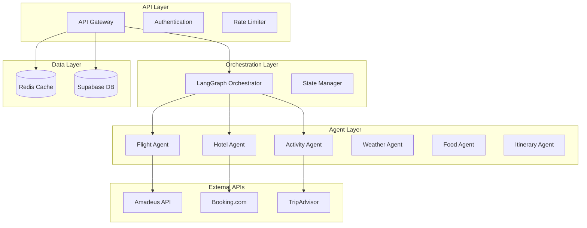

# Components

## API Gateway Service
**Responsibility:** Request routing, authentication, rate limiting, and response coordination

**Key Interfaces:**
- REST API endpoints for all travel planning operations
- WebSocket connections for real-time workflow updates
- Health check and monitoring endpoints

**Dependencies:** Authentication service, Redis cache, workflow orchestrator

**Technology Stack:** FastAPI with middleware for CORS, rate limiting, JWT validation

## LangGraph Workflow Orchestrator
**Responsibility:** Coordinates multi-agent travel planning workflows with state management

**Key Interfaces:**
- Workflow execution API accepting travel requests
- Agent registration and coordination system
- State persistence and recovery mechanisms

**Dependencies:** All travel agents, Redis for state, database for trip storage

**Technology Stack:** LangGraph with custom nodes for each travel planning phase

## Flight Planning Agent
**Responsibility:** Flight search, comparison, and booking integration

**Key Interfaces:**
- Flight search API with flexible date/destination parameters
- Price tracking and alert mechanisms
- Integration with multiple airline booking systems

**Dependencies:** External flight APIs (Amadeus, Skyscanner), Redis cache

**Technology Stack:** Python with httpx for API calls, circuit breaker patterns

## Hotel Booking Agent
**Responsibility:** Accommodation search with location and preference optimization

**Key Interfaces:**
- Hotel search with geographic and amenity filtering
- Price comparison across multiple booking platforms
- Availability checking and booking coordination

**Dependencies:** Booking.com, Expedia, Airbnb APIs, geographic services

**Technology Stack:** Python with location-based search algorithms

## Activity Discovery Agent  
**Responsibility:** Activity and attraction recommendations based on interests

**Key Interfaces:**
- Interest-based activity search and categorization
- Time-based scheduling and duration estimation
- Local event and seasonal activity integration

**Dependencies:** TripAdvisor, Viator, GetYourGuide APIs, weather data

**Technology Stack:** Python with ML-based recommendation algorithms

## Weather Intelligence Agent
**Responsibility:** Weather forecasting and activity impact analysis

**Key Interfaces:**
- Multi-day weather forecasting for destinations
- Weather-based activity recommendations
- Travel advisory generation

**Dependencies:** Weather API services, geographic data

**Technology Stack:** Python with weather data processing algorithms

## Restaurant Recommendation Agent
**Responsibility:** Dining recommendations with cuisine and budget matching

**Key Interfaces:**
- Cuisine-based restaurant search and filtering
- Budget-appropriate dining recommendations
- Local specialty and dietary restriction handling

**Dependencies:** Yelp, Google Places, Zomato APIs, user preference data

**Technology Stack:** Python with cuisine categorization and rating analysis

## Itinerary Coordination Agent
**Responsibility:** Integration of all travel components into optimized daily schedules

**Key Interfaces:**
- Geographic optimization for daily itineraries
- Budget allocation and tracking across categories
- Conflict detection and resolution

**Dependencies:** All other agents, mapping services, optimization algorithms

**Technology Stack:** Python with geographic optimization and scheduling algorithms

## Component Diagrams

