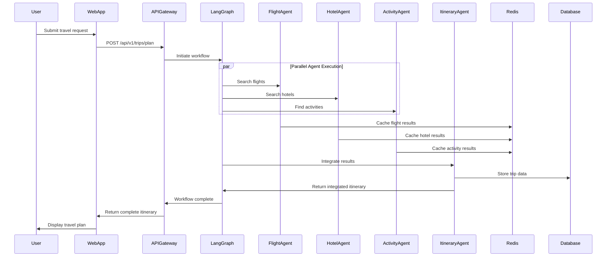

# Core Workflows

```mermaid
sequenceDiagram
    participant User
    participant WebApp
    participant APIGateway
    participant LangGraph
    participant FlightAgent
    participant HotelAgent  
    participant ActivityAgent
    participant ItineraryAgent
    participant Redis
    participant Database
    
    User->>WebApp: Submit travel request
    WebApp->>APIGateway: POST /api/v1/trips/plan
    APIGateway->>LangGraph: Initiate workflow
    
    par Parallel Agent Execution
        LangGraph->>FlightAgent: Search flights
        LangGraph->>HotelAgent: Search hotels
        LangGraph->>ActivityAgent: Find activities
    end
    
    FlightAgent->>Redis: Cache flight results
    HotelAgent->>Redis: Cache hotel results  
    ActivityAgent->>Redis: Cache activity results
    
    LangGraph->>ItineraryAgent: Integrate results
    ItineraryAgent->>Database: Store trip data
    ItineraryAgent->>LangGraph: Return integrated itinerary
    
    LangGraph->>APIGateway: Workflow complete
    APIGateway->>WebApp: Return complete itinerary
    WebApp->>User: Display travel plan
```
