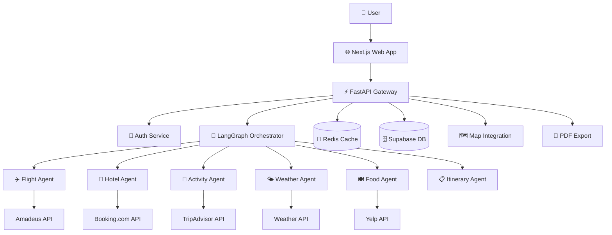

# High Level Architecture

## Technical Summary

The Travel Companion system employs a **microservices-oriented monolith** architecture with FastAPI orchestrating multi-agent workflows through LangGraph. The system uses event-driven patterns for agent coordination, maintains stateful conversations through Redis, and provides real-time travel planning through parallel API integrations. The architecture prioritizes horizontal scalability, fault tolerance, and efficient caching to handle travel industry API rate limits while delivering sub-30-second response times.

## High Level Overview

**Architectural Style:** Microservices-oriented monolith with agent-based service decomposition
**Repository Structure:** Monorepo with clear service boundaries (`packages/api`, `packages/web`, `packages/agents`)
**Service Architecture:** Containerized FastAPI backend with specialized travel planning agents
**Primary User Flow:** Natural language request → LangGraph workflow orchestration → parallel agent execution → unified itinerary response
**Key Decisions:**
- LangGraph for workflow orchestration enables complex multi-step reasoning
- Redis for caching and rate limit management across external travel APIs
- Supabase for user data with vector embeddings for travel preference RAG
- Event-driven architecture for agent coordination and real-time updates

## High Level Project Diagram

## Architectural and Design Patterns

- **Event-Driven Architecture:** Using Redis pub/sub for agent coordination and real-time updates - *Rationale:* Enables async agent execution and progress updates to frontend
- **Repository Pattern:** Abstract data access for users, trips, and preferences - *Rationale:* Enables testing and future database migration flexibility  
- **Agent Pattern:** Specialized agents with single responsibilities (flights, hotels, etc.) - *Rationale:* Aligns with travel domain complexity and external API boundaries
- **Circuit Breaker Pattern:** For external API resilience - *Rationale:* Travel APIs are notoriously unreliable, need graceful degradation
- **CQRS Pattern:** Read/write separation for trip planning vs trip viewing - *Rationale:* Different performance characteristics for planning workflows vs viewing itineraries
- **Saga Pattern:** For coordinated multi-step booking processes - *Rationale:* Travel bookings require complex transaction coordination across services
