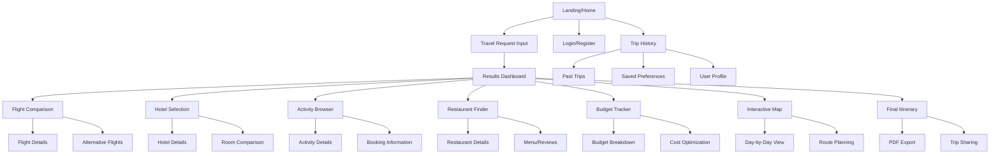
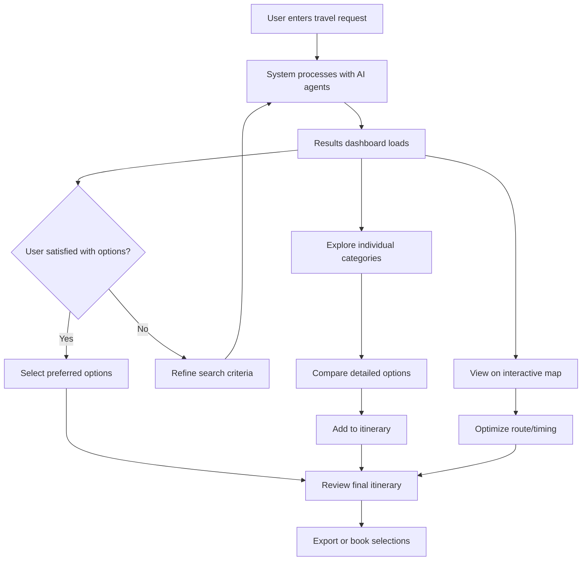
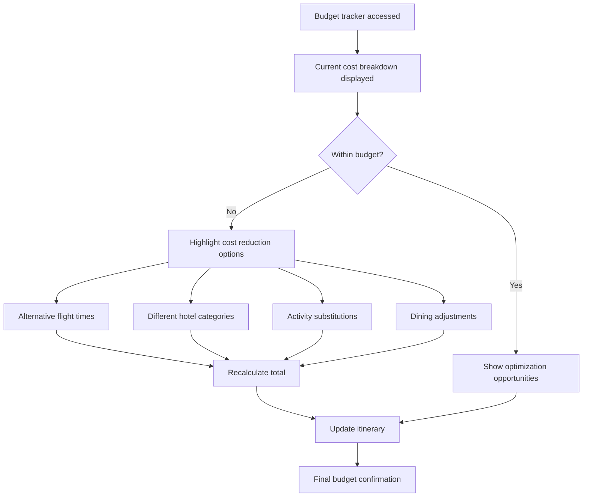

# Travel Companion UI/UX Specification

## Introduction

This document defines the user experience goals, information architecture, user flows, and visual design specifications for Travel Companion's user interface. It serves as the foundation for visual design and frontend development, ensuring a cohesive and user-centered experience.

### Overall UX Goals & Principles

#### Target User Personas

**Busy Professional:** Time-constrained travelers who need efficient, comprehensive planning with minimal input. Prioritizes speed, reliability, and business-friendly options.

**Family Organizer:** Multi-generational trip coordinators managing diverse needs and preferences. Requires clear comparison tools and group-friendly features.

**Adventure Seeker:** Experience-focused travelers wanting discovery and local insights. Values authentic recommendations and off-the-beaten-path suggestions.

**Budget-Conscious Planner:** Cost-aware travelers needing transparent pricing and optimization. Requires detailed cost breakdowns and alternative options.

#### Usability Goals

- **Speed of planning:** Complete trip proposal within 30 seconds of natural language input
- **Cognitive load reduction:** Progressive disclosure prevents information overwhelm during decision-making
- **Trust building:** Transparent pricing, clear data sources, and realistic expectations throughout
- **Mobile accessibility:** Reference-friendly interface during travel with offline PDF capabilities
- **Learning efficiency:** New users complete first trip planning within 5 minutes

#### Design Principles

1. **Conversation over forms** - Natural language input with intelligent interpretation and follow-up questions
2. **Visual storytelling** - Rich imagery and interactive maps make destinations tangible and inspiring
3. **Transparent intelligence** - Show AI reasoning and data sources to build user trust and confidence
4. **Progressive enhancement** - Essential features first, advanced options revealed on demand
5. **Context-aware assistance** - Adapt interface based on trip type, user behavior, and device context

### Change Log

| Date | Version | Description | Author |
|------|---------|-------------|---------|
| 2025-01-XX | v1.0 | Initial UI/UX specification creation | Sally (UX Expert) |

## Information Architecture (IA)

### Site Map / Screen Inventory

### Navigation Structure

**Primary Navigation:** Top-level navigation with Home, Plan Trip, My Trips, and Profile. Sticky header design for consistent access.

**Secondary Navigation:** Contextual tabs within results dashboard (Overview, Map, Budget, Timeline) and category filters (Flights, Hotels, Activities, Dining).

**Breadcrumb Strategy:** Location-aware breadcrumbs showing: Home > Trip Planning > Results > [Category] > Details, with clear path back to overview.

## User Flows

### Core Travel Planning Flow

**User Goal:** Create a comprehensive travel itinerary from a natural language request

**Entry Points:** Home page travel input, direct link sharing, or "Plan New Trip" from dashboard

**Success Criteria:** User receives actionable travel plan with bookable options within 30 seconds

#### Flow Diagram

#### Edge Cases & Error Handling:
- No flights available for dates: Suggest alternative dates with price comparison
- Budget exceeded: Highlight cost-optimized alternatives and trade-off explanations
- API failures: Graceful degradation with cached data and retry mechanisms
- Ambiguous requests: Interactive clarification with smart suggestions
- Location not found: Fuzzy matching with "Did you mean?" suggestions

**Notes:** Flow emphasizes parallel exploration over linear progression. Users can jump between map, budget, and category views seamlessly while maintaining context.

### Budget Planning & Optimization Flow

**User Goal:** Understand and control trip costs while maintaining desired experience quality

**Entry Points:** Budget tracker from main dashboard, cost alerts, or optimization suggestions

**Success Criteria:** User achieves satisfactory itinerary within specified budget constraints

#### Flow Diagram

#### Edge Cases & Error Handling:
- Currency conversion fluctuations: Real-time rate updates with change notifications
- Hidden fees discovered: Transparent fee breakdown with booking platform warnings
- Group payment splitting: Individual cost tracking with shared expense coordination
- Budget exceeded after selections: Smart rollback with alternative suggestions

**Notes:** Emphasizes transparency and user control over automatic optimization. All cost changes clearly explained with impact analysis.

## Wireframes & Mockups

**Primary Design Files:** Figma workspace for Travel Companion UI designs - [Link to be provided after initial wireframes]

### Key Screen Layouts

#### Home/Landing Screen

**Purpose:** Welcome users and capture initial travel intent through conversational interface

**Key Elements:**
- Hero section with inspiring travel imagery and clear value proposition
- Prominent natural language input field with example prompts
- Quick-start options for common trip types (Weekend Getaway, Business Trip, Family Vacation)
- Trust indicators (user testimonials, trip completion stats, data security)
- Recent trips for returning users

**Interaction Notes:** Input field expands on focus with contextual help. Auto-suggestions appear as user types. One-click trip type selection pre-fills common parameters.

**Design File Reference:** Home-Screen-Desktop-v1, Home-Screen-Mobile-v1

#### Results Dashboard

**Purpose:** Present comprehensive travel options with easy comparison and selection tools

**Key Elements:**
- Overview cards for flights, hotels, activities, and budget summary
- Filter panel with smart defaults based on user preferences  
- Interactive map integration showing geographic context
- Real-time budget tracker with visual indicators
- Save/compare functionality for decision support

**Interaction Notes:** Sticky filter panel on scroll. Map and list views synchronized. Hover states reveal quick comparison data. Mobile design uses bottom sheet for filters.

**Design File Reference:** Results-Dashboard-v1, Results-Mobile-v1

#### Interactive Map View

**Purpose:** Provide geographic context for travel decisions and route optimization

**Key Elements:**
- Full-screen map with hotel, activity, and restaurant markers
- Day-by-day timeline overlay with route visualization
- Category filtering with color-coded markers
- Distance and travel time calculations
- Cluster expansion for dense areas

**Interaction Notes:** Smooth zoom transitions. Marker click reveals summary card. Route optimization with drag-and-drop reordering. Mobile gestures for navigation.

**Design File Reference:** Map-View-Desktop-v1, Map-Mobile-v1

## Component Library / Design System

**Design System Approach:** Custom design system built on Tailwind CSS foundation, optimized for travel planning workflows and data-dense interfaces.

### Core Components

#### TravelInputField

**Purpose:** Natural language travel request capture with intelligent assistance

**Variants:** Standard (home page), Compact (refinement), Quick Actions (preset options)

**States:** Empty, Focused, Processing, Success, Error, Disabled

**Usage Guidelines:** Always provide example prompts. Show processing state during AI analysis. Include voice input option for accessibility.

#### ResultCard

**Purpose:** Standardized presentation of flight, hotel, activity, and restaurant options

**Variants:** Compact (list view), Expanded (detailed view), Comparison (side-by-side)

**States:** Default, Hover, Selected, Saved, Unavailable

**Usage Guidelines:** Consistent information hierarchy across all card types. Always include price and key differentiators. Action buttons contextual to content type.

#### BudgetTracker

**Purpose:** Real-time budget monitoring and optimization assistance

**Variants:** Summary (dashboard), Detailed (breakdown), Mobile (condensed)

**States:** Under budget, At budget, Over budget, Optimized

**Usage Guidelines:** Use clear visual indicators for budget status. Provide actionable optimization suggestions. Support multiple currencies with automatic conversion.

#### InteractiveMap

**Purpose:** Geographic visualization of travel plans with contextual information

**Variants:** Full screen, Embedded, Mini-map (mobile)

**States:** Loading, Interactive, Route planning, Cluster view

**Usage Guidelines:** Maintain consistent marker styles across categories. Provide clear zoom and pan controls. Include accessibility alternatives for map-dependent information.

## Branding & Style Guide

### Visual Identity

**Brand Guidelines:** Clean, modern aesthetic emphasizing trust and efficiency. Travel-inspired but not clichéd. Professional yet approachable for diverse user types.

### Color Palette

| Color Type | Hex Code | Usage |
|------------|----------|--------|
| Primary | #2563eb | Primary actions, links, selected states |
| Secondary | #0ea5e9 | Supporting elements, hover states |
| Accent | #10b981 | Success indicators, positive feedback |
| Success | #059669 | Confirmations, completed bookings |
| Warning | #d97706 | Price alerts, important notices |
| Error | #dc2626 | Errors, unavailable options |
| Neutral | #64748b, #f1f5f9 | Text, borders, background layers |

### Typography

#### Font Families
- **Primary:** Inter (clean, readable, professional)
- **Secondary:** Merriweather (travel content, inspiration)
- **Monospace:** JetBrains Mono (code, confirmation numbers)

#### Type Scale

| Element | Size | Weight | Line Height |
|---------|------|--------|-------------|
| H1 | 2.5rem | 700 | 1.2 |
| H2 | 2rem | 600 | 1.3 |
| H3 | 1.5rem | 600 | 1.4 |
| Body | 1rem | 400 | 1.6 |
| Small | 0.875rem | 400 | 1.5 |

### Iconography

**Icon Library:** Heroicons for interface elements, custom travel icons for domain-specific content

**Usage Guidelines:** 24px standard size for interface icons, 16px for inline content, 32px for feature highlights. Maintain consistent stroke width and corner radius.

### Spacing & Layout

**Grid System:** 12-column responsive grid with 24px gutters on desktop, 16px on mobile

**Spacing Scale:** 4px base unit (4, 8, 12, 16, 24, 32, 48, 64, 96px) for consistent rhythm throughout interface

## Accessibility Requirements

### Compliance Target

**Standard:** WCAG 2.1 AA compliance with selected AAA features for enhanced usability

### Key Requirements

**Visual:**
- Color contrast ratios: 4.5:1 minimum for normal text, 3:1 for large text
- Focus indicators: 3px outline with high contrast color, visible on all interactive elements
- Text sizing: Supports up to 200% zoom without horizontal scrolling

**Interaction:**
- Keyboard navigation: Tab order follows logical flow, all features accessible via keyboard
- Screen reader support: Semantic HTML, ARIA labels, meaningful headings structure
- Touch targets: Minimum 44px target size on mobile, adequate spacing between interactive elements

**Content:**
- Alternative text: Descriptive alt text for all images, especially map markers and travel photos
- Heading structure: Logical H1-H6 hierarchy for screen reader navigation
- Form labels: Explicit labels for all form inputs with error message association

### Testing Strategy

Regular accessibility audits using axe-core, manual keyboard navigation testing, screen reader testing with NVDA/VoiceOver, and user testing with accessibility-focused participants.

## Responsiveness Strategy

### Breakpoints

| Breakpoint | Min Width | Max Width | Target Devices |
|------------|-----------|-----------|----------------|
| Mobile | 320px | 767px | Phones, small tablets |
| Tablet | 768px | 1023px | iPads, large tablets |
| Desktop | 1024px | 1439px | Laptops, standard monitors |
| Wide | 1440px | - | Large monitors, external displays |

### Adaptation Patterns

**Layout Changes:** Stack cards vertically on mobile, grid layouts on desktop. Sidebar filters become bottom sheets on mobile.

**Navigation Changes:** Hamburger menu on mobile, full navigation on desktop. Tab bars replace horizontal scrolling on mobile.

**Content Priority:** Hide secondary information on mobile, progressive disclosure through expandable sections. Map becomes full-screen overlay on mobile.

**Interaction Changes:** Touch-friendly targets and gestures on mobile. Hover states and tooltips on desktop. Swipe navigation for mobile card carousels.

## Animation & Micro-interactions

### Motion Principles

Purposeful animations that provide feedback, guide attention, and create spatial relationships. Respect user preferences for reduced motion. All animations under 500ms for perceived performance.

### Key Animations

- **Page transitions:** Slide transitions between major sections (300ms, ease-out)
- **Card hover:** Subtle lift and shadow increase (150ms, ease-out)  
- **Loading states:** Skeleton screens and progress indicators (continuous, linear)
- **Success feedback:** Checkmark animation and color transition (400ms, bounce-out)
- **Map interactions:** Smooth zoom and pan with momentum (variable, ease-out)
- **Budget updates:** Number counting animation for cost changes (600ms, ease-in-out)

## Performance Considerations

### Performance Goals

- **Page Load:** First Contentful Paint under 1.5 seconds on 3G connection
- **Interaction Response:** UI feedback within 100ms, full response within 1 second
- **Animation FPS:** Maintain 60fps for all animations and interactions

### Design Strategies

Progressive image loading with blur-up technique for hero images. Virtualized lists for large result sets. Critical CSS inlining for above-the-fold content. Efficient re-rendering strategies for real-time budget updates.

## Next Steps

### Immediate Actions

1. Stakeholder review and feedback incorporation
2. High-fidelity mockup creation in Figma
3. Interactive prototype development for user testing
4. Component library documentation and development
5. Accessibility audit planning and implementation
6. Performance budget establishment and monitoring setup

### Design Handoff Checklist

- [x] All user flows documented
- [x] Component inventory complete  
- [x] Accessibility requirements defined
- [x] Responsive strategy clear
- [x] Brand guidelines incorporated
- [x] Performance goals established

## Checklist Results

_This section will be populated after running the UI/UX checklist to validate specification completeness and quality._